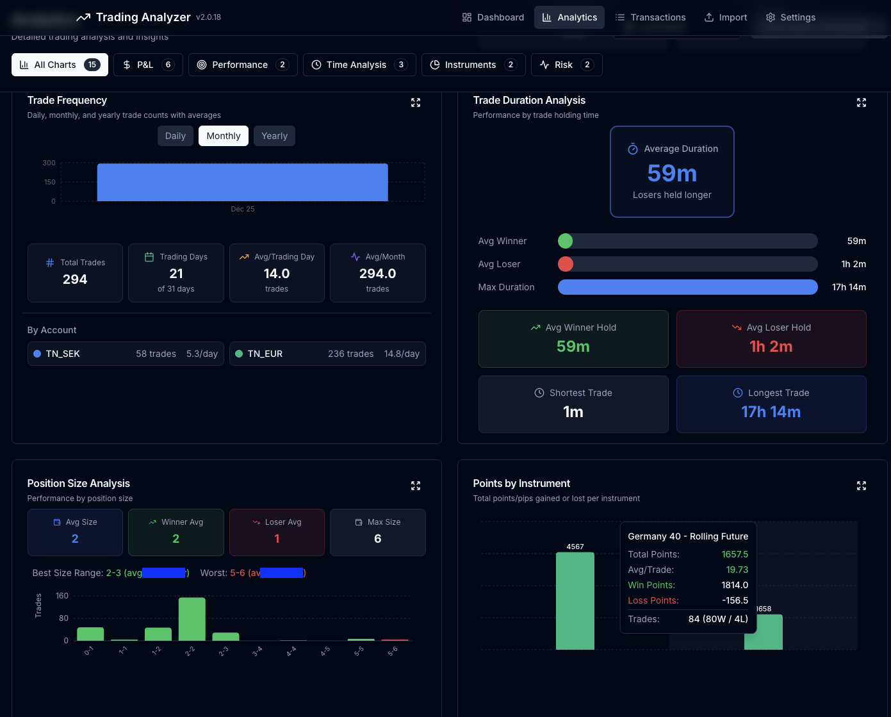

# Trading Analyzer v2.0.0

A modern desktop application for analyzing trading data and generating insights from broker transaction exports.



## Download

### Pre-built Releases

| Platform | Download |
|----------|----------|
| macOS | [TradingAnalyzer-macOS.dmg](https://github.com/lakjdfalken/trading-analyzer/releases/latest/download/TradingAnalyzer-macOS.dmg) |
| Windows | [TradingAnalyzer-Windows-x64.zip](https://github.com/lakjdfalken/trading-analyzer/releases/latest/download/TradingAnalyzer-Windows-x64.zip) |

Or visit the [Releases page](https://github.com/lakjdfalken/trading-analyzer/releases) for all versions.

## Features

### Dashboard
- Real-time KPIs: Total P/L, Win Rate, Profit Factor, Max Drawdown
- Balance history chart with multi-account support
- Monthly P/L breakdown
- Win rate by instrument
- Recent trades overview

### Transactions
- Browse, search, and filter all trades
- Sort by any column
- Date range filtering
- Export to CSV
- Pagination with customizable page size

### Analytics
- Daily P/L heatmap
- Drawdown analysis with peak-to-trough calculation
- Hourly performance patterns
- Weekday performance breakdown
- Win/loss streaks
- Trade duration statistics

### Data Management
- CSV import with automatic column mapping
- Support for multiple brokers
- Multi-account tracking
- Multi-currency support with conversion

### User Interface
- Modern dark mode UI
- Responsive charts with tooltips
- Expandable chart views
- Persistent filter preferences

## Supported Brokers

- **Trade Nation** (Serial column format)
- **TD365** (Ref. No. column format)
- **Generic CSV** (auto-detects common column names)

## Installation

### Option 1: Download Pre-built App (Recommended)

1. Download the appropriate installer for your platform from the [Releases page](https://github.com/lakjdfalken/trading-analyzer/releases)
2. **macOS**: Open the DMG and drag to Applications. On first run, right-click and select "Open" to bypass Gatekeeper
3. **Windows**: Extract the ZIP and run `Trading Analyzer.exe`

### Option 2: Run from Source

**Prerequisites:**
- Python 3.9+
- Node.js 18+

**Setup:**

```bash
# Clone repository
git clone https://github.com/lakjdfalken/trading-analyzer.git
cd trading-analyzer

# Setup Python environment
python -m venv .venv
source .venv/bin/activate  # Windows: .venv\Scripts\activate
pip install -r requirements.txt

# Build frontend
cd frontend
npm install
npm run build
cd ..

# Run the application
python app.py
```

### Option 3: Development Mode

**Terminal 1 - API Server:**
```bash
source .venv/bin/activate
python run_api.py
```

**Terminal 2 - Frontend Dev Server:**
```bash
cd frontend
npm run dev
```

Open http://localhost:3000

## CSV Import Format

The application accepts CSV exports with the following columns:

| Column | Description |
|--------|-------------|
| Transaction Date | Date/time of the trade |
| Serial / Ref. No. | Unique reference number |
| Action | Buy/Sell action |
| Description | Instrument name |
| Amount | Position size |
| Open Period | Entry date/time |
| Opening | Entry price |
| Closing | Exit price |
| P/L | Profit/Loss |
| Status | Trade status |
| Balance | Account balance after trade |
| Currency | Trade currency |

## Building from Source

### macOS

```bash
source .venv/bin/activate
cd frontend && npm run build && cd ..
pyinstaller trading_analyzer.spec

# Remove quarantine attribute
xattr -cr "dist/Trading Analyzer.app"

# Run
open "dist/Trading Analyzer.app"
```

### Windows

```powershell
.venv\Scripts\activate
cd frontend
npm run build
cd ..
pyinstaller trading_analyzer.spec

# Run
dist\Trading Analyzer\Trading Analyzer.exe
```

## Architecture

```
trading-analyzer/
├── frontend/                 # Next.js 14 frontend
│   ├── src/
│   │   ├── app/             # Pages (dashboard, transactions, analytics)
│   │   ├── components/      # React components (charts, KPIs, trades)
│   │   ├── store/           # Zustand state management
│   │   └── api/             # API client
│   └── package.json
├── src/
│   ├── api/                 # FastAPI backend
│   │   ├── routers/         # API endpoints
│   │   ├── models/          # Pydantic schemas
│   │   └── services/        # Database & currency services
│   ├── create_database.py   # Database schema
│   ├── import_data.py       # CSV import logic
│   ├── db_path.py           # Cross-platform database path
│   └── settings.py          # Configuration
├── app.py                   # Desktop app entry point
├── run_api.py               # API server runner
├── trading_analyzer.spec    # PyInstaller configuration
└── requirements.txt
```

## API Documentation

When running in development mode, API documentation is available at:
- Swagger UI: http://localhost:8000/api/docs
- ReDoc: http://localhost:8000/api/redoc

## Data Storage

The application stores data in a platform-specific location:

| Platform | Location |
|----------|----------|
| macOS | `~/Library/Application Support/TradingAnalyzer/trading.db` |
| Windows | `%LOCALAPPDATA%\TradingAnalyzer\trading.db` |
| Linux | `~/.local/share/TradingAnalyzer/trading.db` |

## What's New in v2.0.0

- **Standalone Desktop App**: Native application for macOS and Windows
- **Improved Charts**: Win Rate by Instrument now displays proper market names
- **Enhanced Export**: CSV export for filtered transactions
- **Better KPIs**: Corrected Max Drawdown calculation (peak-to-trough)
- **Date Filtering**: Persistent date range selection across sessions
- **UI Improvements**: Tooltips explaining KPI calculations
- **Performance**: Optimized data fetching and caching

## License

MIT License - See [LICENSE](LICENSE) file for details.

## Contributing

Contributions are welcome! Please:

1. Open an issue to discuss proposed changes
2. Fork the repository
3. Create a feature branch
4. Submit a pull request

## Support

- [Open an issue](https://github.com/lakjdfalken/trading-analyzer/issues) for bug reports
- [Discussions](https://github.com/lakjdfalken/trading-analyzer/discussions) for questions and ideas